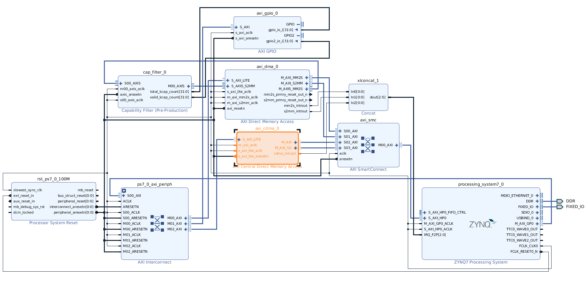
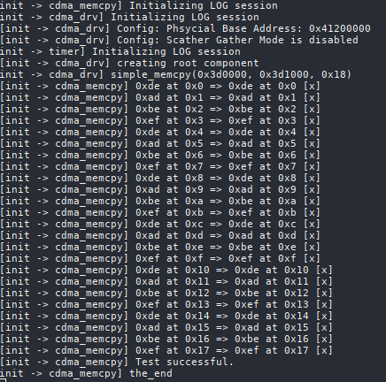
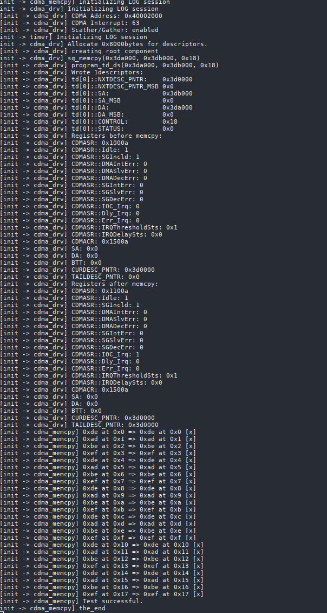
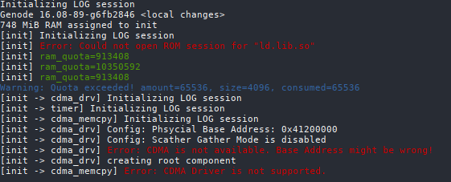
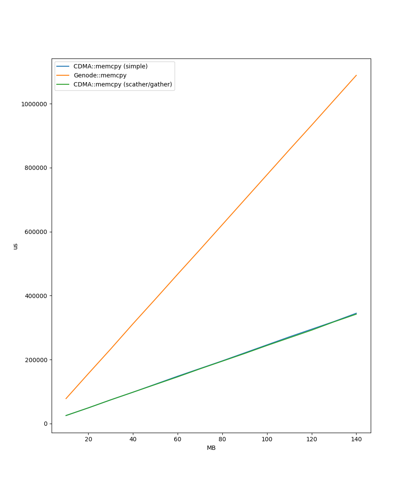

# CDMA Driver

This is the documentation for the CDMA driver `cdma_drv` which is located in:
* Implementation `src/drivers/cdma`
* Header Files `includes/cdma`
* Driver Session `/includes/cdma_session`

The `cdma_drv` provides a hardware-based acceleration of memory copying. 

It is shipped with two test application `cdma_simple_memcpy` and `cdma_sg_memcpy`.

# Hardware Component

The driver is only tested on a Zybo Board and does not work in Qemu. Furthermore
a hardware implementation for the FPGA chip is required.



# Software Component

The hardware component is accessable on the physcial memory address `0x4002000`
and provides the interrupt port `63`. Furthermore, it supports a simple memory
copying mode and an advanced copying process named scather/gather mode.

## Simple Mode
A single memory copy with CDMA is
limited to 67,108,863 bytes of data (BTT, bytes to copy). In order to copy a
bigger amount of data, the component must be programmed multiple times. This is
done in the simple mode of `cdma_drv`. 

## Scather Gather Mode
Scatter Gather is a mechanism that allows for automated data transfer scheduling
through a pre-programmed instruction list of transfer descriptors (Scatter
Gather Transfer Descriptor Definition). This instruction list is programmed by
`cdma_drv` into a memory-resident data structure that is accessible by the AXI
CDMA SG interface. 


## Configuration

In order to use the the driver, the run script requires following changes.

1. Add the driver to the build list
   ```diff
   - build { core init ...}
   + build { core init drivers/cdma ...}
   ```
2. Add a Configuration Section for `cdma_drv`
   ```diff
   install_config {
   <config>
       <parent-provides>
		   <service name="PD"/>
		   <service name="CPU"/>
		   <service name="ROM"/>
		   <service name="RAM"/>
		   <service name="RM"/>
		   <service name="LOG"/>
		   <service name="IO_MEM"/>
		   <service name="IO_PORT"/>
		   <service name="IRQ"/>
       </parent-provides>
       <default-route>
		   <any-service> <parent/> <any-child/> </any-service>
       </default-route>
   + <start name="cdma_drv">
   +	<resource name="RAM" quantum="10M"/>
   +	<provides><service name="Cdma"/></provides>
   +    <config>
   +        <cdma address="0x40002000" irq="63" sg_enabled="false"/>
   +    </config>
   + </start>
   </config>}
   ```
   The XML attribute `address` defines the base address of the physical memory
   address of the CDMA hardware component. `sg_enabled` can be set to `true` or
   `false` in order to force disabling scather/gather mode. If scather/gather
   mode is enabled, but not supported by the hardware, the driver will
   automatically fallback to simple mode. 
3. Add Driver to boot image
   ```diff
   - build_boot_image { core init ... }
   + build_boot_image { core init cdma_drv ... }
   ```

# Verbose & Debugging
Add following lines to `src/drivers/cdma/target.mk` in order to build the driver
with debugging output.
```
# In order to enable verbosity:
CC_OPT += -DVERBOSE

# in order to enable debug output
CC_OPT += -DDEBUG
```

# Test Applications

Both test applications `cdma_simple_memcpy` and `cdma_sg_memcpy` bases on the
source code `src/test/cdma_memcpy` and only differ in enabled and disabled
scather/gather mode. Following is implmented:

1. Create two Dataspaces `src_ds` and `dst_ds`.
2. Fill `src_ds` with `0x181` bytes of a specific pattern.
3. Write an arbitrary byte to `dst_ds`, otherwise Genode does not initialize the
   Dataspace in memory.
4. Detach both dataspaces, otherwise the data are not flushed.
5. Run `cdma.memory(...)` and handle over the physical memory addresses of both
   dataspaces.
6. Attach both dataspaces again and compare the contents of both dataspaces. The
   test succeeds if both contents are identical.
   
## Results

* **Simple Mode** succeeds
  
  
* **Scather Gather Mode** succeeds
  

* **Device Missing**
  

## Performance

* **Simple Mode**
  


# References 
* [AXI Central Direct Memory Access v4.1 LogiCORE IP Product Guide](https://www.xilinx.com/support/documentation/ip_documentation/axi_cdma/v4_1/pg034-axi-cdma.pdf)

