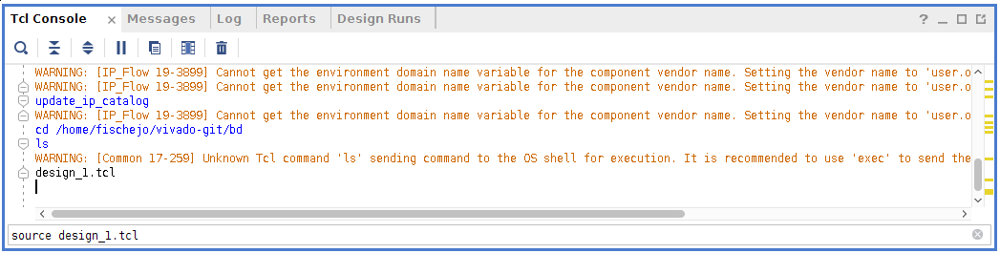

# How to Create Bitstream for FPGA of Zybo Board

The `cdma_drv` and `kcap_drv` does not work without the corresponding FPGA
implementation. It is necessary to flash the FPGA with a bitstream file. This
tutorial shows, how to create the `fpga/rtcr_hw.bit` bitstream file. The
software Vivado 2018.2 is required. Furthermore configuration files for the Zybo
Board of the vendor Digilent should be installed in Vivado.

## Create New Project
1. Create a New Vivado Project
   

2. Choose a project name and a location.
   

3. Choose RTL Project and select `Do not specify sources at this time`.
   

4. Search for the Board `Zybo` and select it.
   

5. Click `Finish`.
   

## Add Custom IP

6. Open **Tools** -> **Settings** and select tab **IP** -> **Repository**.
   
   Add the directory `genode-CheckpointRestore-SharedMemory/fpga/ip_repo` to the
   list of IP repositories.
   

## Create Block Design
7. Go to the `Tcl Console` and use the command `cd` to change the directory to 
   `genode-CheckpointRestore-SharedMemory/fpga/bd/`.
   

8. Source the block design: `source design_1.tcl`.
   

10. Go to the Tab `Sources`. Right click on the design will open the Context
    Menu. Click the Option `Create a HDL Wrapper`.
    
        

11. Finally, you are ready to build the Bitstream by going through the phases
    `Synthesis`, `Implementation` and `Generate Bitstream`.
    

# References
* [Project Export for Vivado](http://fpganow.com/index.php/tag/project-export-for-vivado/)
